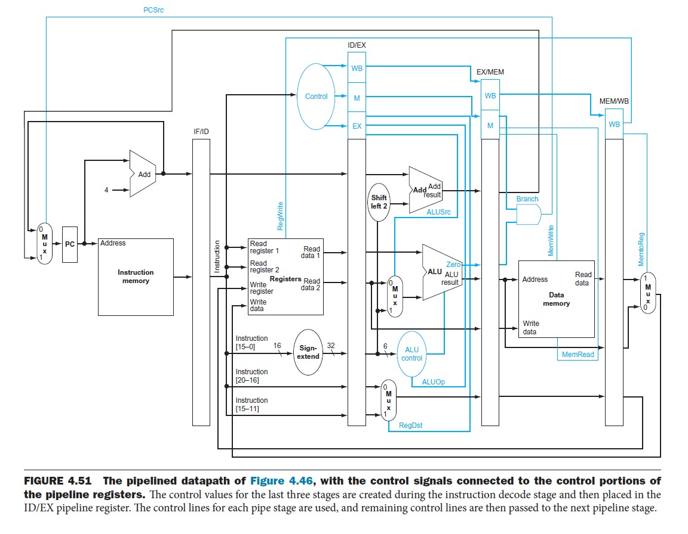
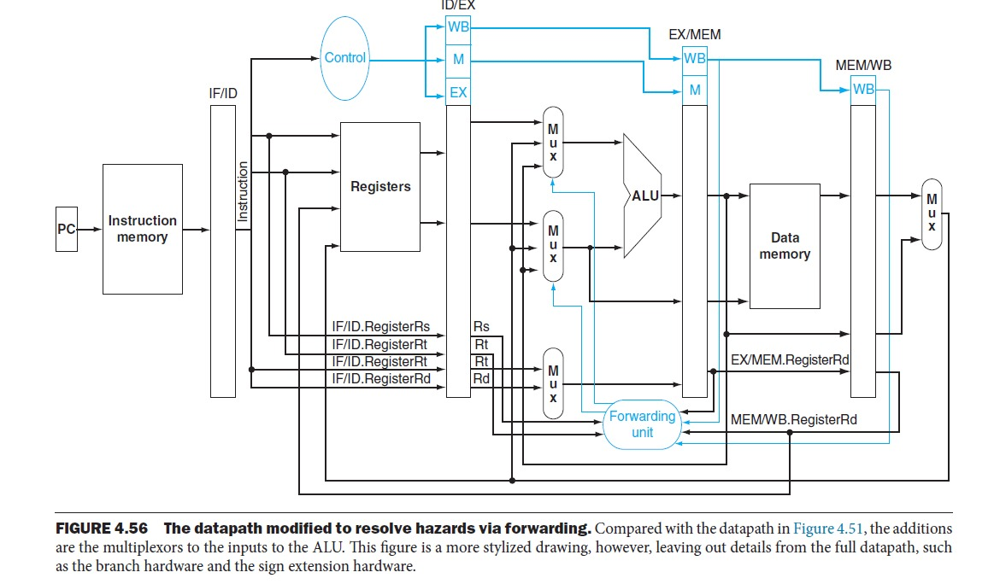
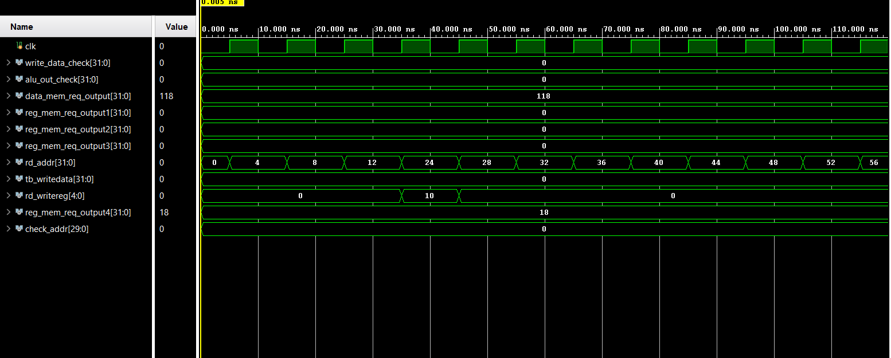
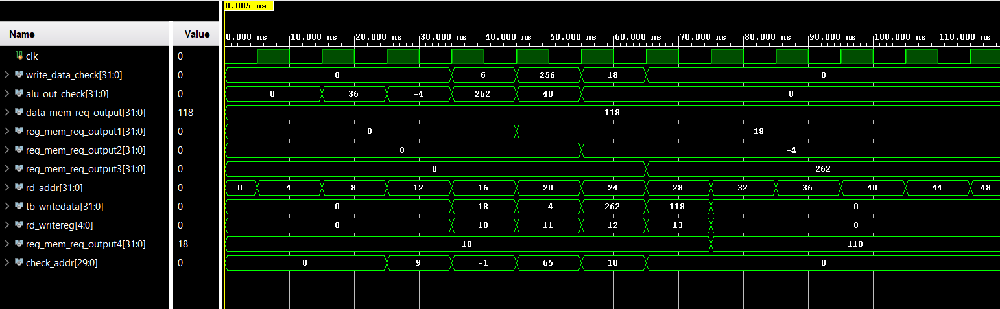
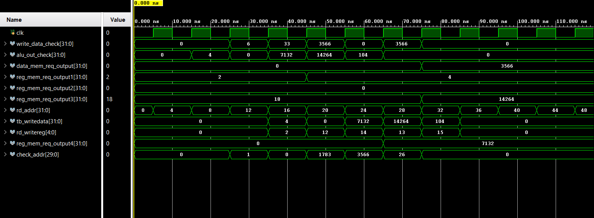

# 32-Bit MIPS Pipelined Processor (5-Stage)

This repository contains a Verilog implementation of a 32-bit processor based on the MIPS architecture. The design utilizes a classic 5-stage execution pipeline: **Instruction Fetch (IF), Instruction Decode (ID), Execute (EX), Memory Access (MEM), and Write Back (WB)**. Additionally, the CPU is equipped to handle **branching** and **jumping** operations, along with a **data forwarding** mechanism to prevent pipeline stalls.

---

## Key Capabilities

* **Pipelined Architecture:** Utilizes a standard 5-stage datapath for improved instruction throughput.
* **Instruction Support:** Capable of executing standard ALU computations, memory read/writes, and control flow operations (branches and jumps).
* **Hazard Mitigation:** Features a dedicated **forwarding unit** to dynamically resolve data hazards without halting the pipeline.
* **Simulation & Verification:** Includes a robust testbench with various instruction scenarios, fully verified using waveform analysis in Xilinx Vivado.

---

## Project Structure

* `top.v` — The top-level wrapper that integrates all sub-modules.
* `ALU_Unit.v`, `alu_control.v`, `control_unit.v` — The primary arithmetic and central control logic modules.
* `IFID_reg.v`, `IDEX.v`, `EXMEM_reg.v`, `MEMWB.v` — The intermediate registers connecting each pipeline stage.
* `ins_mem.v`, `data_mem.v`, `registers.v` — Instruction memory, data memory, and the main register bank.
* `forwarding_unit.v` — The dedicated logic block for detecting and bypassing data dependencies.
* `tb.v` — The testbench module containing sample machine code to validate the processor's behavior.

---

## Architecture & Results

### Pipeline Architecture

### Hazard Forwarding Logic

### Simulation Waveform 1

### Simulation Waveform 2

### Simulation Waveform 3

---

## Verification Strategy

The CPU's functionality has been evaluated using a comprehensive mix of arithmetic, memory, and control instructions. The provided simulation waveforms confirm that the pipeline operates smoothly and that the forwarding unit successfully intercepts and resolves potential data hazards.
